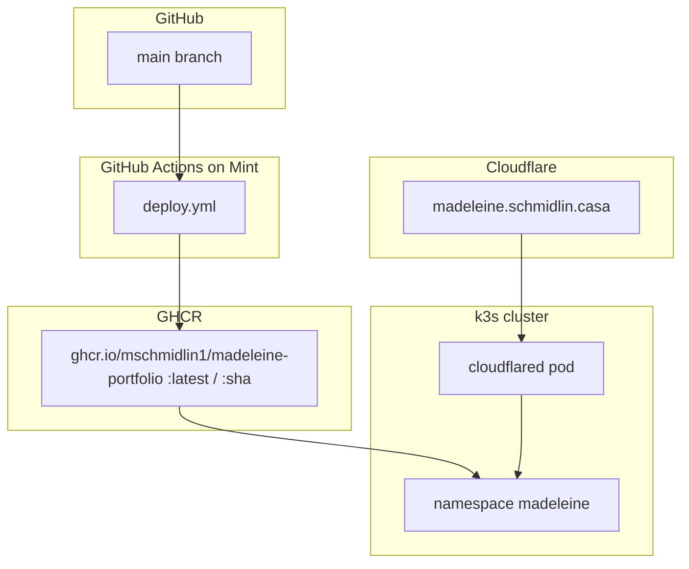

# Deployment Guide — `madeleine.schmidlin.casa`

This guide walks through deploying **Madeleine Schmidlin — Portfolio** to the same homelab stack used by [Valhalla Landing Page](https://github.com/mschmidlin1/ValhallaLandingPage) and [Dr. JAM](https://github.com/mschmidlin1/dr-jam): a **self-hosted GitHub Actions runner** on the home Linux PC (Mint), **Docker** images on **GHCR**, **k3s** on Mint, and public HTTPS via the existing **Cloudflare Tunnel** (`cloudflared`) on `schmidlin.casa`.

**Target URL:** `https://madeleine.schmidlin.casa`

**Prerequisites (already in place from Valhalla / Dr. JAM):**

- k3s cluster running on Mint with `kubectl` working
- `cloudflared` pod healthy in the `cloudflared` namespace
- `schmidlin.casa` **Active** in Cloudflare with SSL/TLS mode **Full**
- You can SSH to Mint and run `kubectl`

For background on how those pieces fit together, see the Valhalla docs at `~/repos/valhallalandingpage/docs/` — especially [Self-Hosting.md](https://github.com/mschmidlin1/ValhallaLandingPage/blob/main/docs/Self-Hosting.md) and [CustomDomainSetup.md](https://github.com/mschmidlin1/ValhallaLandingPage/blob/main/docs/CustomDomainSetup.md). Dr. JAM's [Deployment.md](https://github.com/mschmidlin1/dr-jam/blob/main/docs/Deployment.md) follows the same pattern end-to-end.

---

## Summary

| Item | Value |
|------|-------|
| **Public URL** | `https://madeleine.schmidlin.casa` |
| **GitHub repo** | `github.com/mschmidlin1/madeleine-portfolio` |
| **Deploy trigger** | Push to `main` (or manual workflow run) |
| **GHCR image** | `ghcr.io/mschmidlin1/madeleine-portfolio` |
| **K8s namespace** | `madeleine` |
| **In-cluster Service URL** | `http://madeleine.madeleine.svc.cluster.local:80` |
| **Container** | nginx:alpine serving `src/` |

**What is shared with Valhalla and Dr. JAM:** one k3s cluster, one `cloudflared` tunnel, one Mint box. You add a **new namespace**, a **new GHCR package**, a **new self-hosted runner** for this repo, and one **new tunnel public hostname**.

**What is different from Dr. JAM:** This site is a small static portfolio — HTML, CSS, JS, a headshot, and a resume PDF under `src/`. There is no separate `resources/` tree and no large audio assets. The Docker image is lightweight; first builds and deploys are fast.

---

## Architecture



When a visitor opens `https://madeleine.schmidlin.casa`:

1. Cloudflare DNS resolves the hostname and terminates HTTPS at the edge.
2. Traffic flows through the existing outbound tunnel to the `cloudflared` pod.
3. `cloudflared` forwards to `http://madeleine.madeleine.svc.cluster.local:80`.
4. The cluster **Service** routes to the **Pod** running nginx.
5. nginx serves `index.html`, CSS, JS, the headshot, favicon, and resume PDF from the container filesystem.

---

## Migration overview

| Phase | What |
|-------|------|
| 1 | Add `Dockerfile` and `.dockerignore` |
| 2 | Add Kubernetes manifests under `k8s/` |
| 3 | Register a self-hosted runner for **this** repo |
| 4 | Add `.github/workflows/deploy.yml` |
| 5 | Configure GitHub Actions permissions and GHCR package visibility |
| 6 | Push to `main` — first automated deploy |
| 7 | Add Cloudflare Tunnel public hostname for `madeleine.schmidlin.casa` |
| 8 | Verify end-to-end |

Phases 1–4 can land on a feature branch and merge to `main` via PR. The workflow only runs after it exists on `main` (or you push directly to `main`).

---

## Phase 1 — Docker image

The portfolio is a static site. All production assets live under `src/`:

- `src/index.html`, `src/styles.css`, `src/main.js`
- `src/assets/headshot.JPG`, `src/assets/favicon.svg`, `src/assets/resume.pdf`

HTML references assets with paths like `assets/headshot.JPG`, so nginx's document root must be the contents of `src/`.

> **Note:** The repo also has a top-level `assets/` folder used during early setup. Production serving uses **`src/assets/` only**. Do not copy the root `assets/` directory into the image unless you intentionally change the site layout.

### 1.1 Create `Dockerfile` at the repo root

```dockerfile
FROM nginx:alpine

COPY src/ /usr/share/nginx/html/

EXPOSE 80
```

### 1.2 Create `.dockerignore` at the repo root

Keeps the build context small and excludes files that should not ship in the image:

```gitignore
.git
.github
.vscode
node_modules
k8s
docs
scripts
README.md
package.json
package-lock.json
.gitignore
.dockerignore
Dockerfile
.DS_Store
**/.DS_Store
```

Do **not** exclude `src/` — the site and assets are required in production.

### 1.3 Resume PDF before build

The site links to `assets/resume.pdf`. Ensure that file exists under `src/assets/` before building the image:

**Option A — generate the placeholder in CI (recommended until you have a final resume):**

```bash
python3 scripts/generate-resume.py
```

**Option B — commit a final resume PDF:**

Replace `src/assets/resume.pdf` with the real document and commit it. You can skip the generate step in CI once the PDF is maintained manually.

### 1.4 Local smoke test (optional but recommended)

From the repo root on a machine with Docker:

```bash
python3 scripts/generate-resume.py   # if resume.pdf is missing or stale
docker build -t madeleine-portfolio-local .
docker run --rm -p 8080:80 madeleine-portfolio-local
```

Open `http://localhost:8080/` in a browser. Confirm:

- Headshot loads on the About section
- **Download Resume** downloads `resume.pdf`
- Navigation and mobile menu work

Stop the container with Ctrl+C.

---

## Phase 2 — Kubernetes manifests

Create a `k8s/` directory with Kustomize manifests. Do **not** add `cloudflared` here — the tunnel is cluster-wide infrastructure already deployed from Valhalla.

### 2.1 Directory layout

```text
k8s/
  namespace.yaml
  deployment.yaml
  service.yaml
  kustomization.yaml
```

### 2.2 `k8s/namespace.yaml`

```yaml
apiVersion: v1
kind: Namespace
metadata:
  name: madeleine
```

### 2.3 `k8s/deployment.yaml`

```yaml
apiVersion: apps/v1
kind: Deployment
metadata:
  name: madeleine
  namespace: madeleine
spec:
  replicas: 1
  selector:
    matchLabels:
      app: madeleine
  template:
    metadata:
      labels:
        app: madeleine
    spec:
      containers:
        - name: app
          image: ghcr.io/mschmidlin1/madeleine-portfolio:latest
          ports:
            - containerPort: 80
          livenessProbe:
            httpGet:
              path: /
              port: 80
            initialDelaySeconds: 5
            periodSeconds: 10
          readinessProbe:
            httpGet:
              path: /
              port: 80
            initialDelaySeconds: 3
            periodSeconds: 5
          resources:
            requests:
              cpu: 50m
              memory: 64Mi
            limits:
              cpu: 250m
              memory: 128Mi
```

Resource requests are lower than Dr. JAM's because this image is small (no audio assets).

### 2.4 `k8s/service.yaml`

```yaml
apiVersion: v1
kind: Service
metadata:
  name: madeleine
  namespace: madeleine
spec:
  type: ClusterIP
  selector:
    app: madeleine
  ports:
    - port: 80
      targetPort: 80
```

### 2.5 `k8s/kustomization.yaml`

```yaml
apiVersion: kustomize.config.k8s.io/v1beta1
kind: Kustomization

resources:
  - namespace.yaml
  - deployment.yaml
  - service.yaml
```

### 2.6 Apply once manually (optional)

On Mint, after the manifests exist locally or in a checkout:

```bash
kubectl apply -k k8s/
kubectl get all -n madeleine
```

The pod will not reach **Running** until an image exists on GHCR (Phase 6). `ImagePullBackOff` before the first CI build is expected.

---

## Phase 3 — Self-hosted GitHub Actions runner

Runners are registered **per repository**. Even if Mint already has runners for Valhalla or Dr. JAM, you need a **separate** runner for `madeleine-portfolio`.

### 3.1 Register the runner on Mint

1. Open [github.com/mschmidlin1/madeleine-portfolio/settings/actions/runners](https://github.com/mschmidlin1/madeleine-portfolio/settings/actions/runners).
2. Click **New self-hosted runner** → **Linux** → **x64**.
3. On Mint, create a dedicated directory (do not reuse another project's runner folder):

   ```bash
   mkdir -p ~/actions-runner-madeleine-portfolio && cd ~/actions-runner-madeleine-portfolio
   ```

4. Copy and run the **Configure** commands from GitHub exactly (download tarball, extract, `./config.sh --url https://github.com/mschmidlin1/madeleine-portfolio --token ...`).
5. At the prompts, press **Enter** to accept defaults (runner group, hostname as name, `self-hosted` label, `_work` folder).
6. Install and start the service:

   ```bash
   sudo ./svc.sh install
   sudo ./svc.sh start
   sudo ./svc.sh status
   ```

Ensure the runner user is in the `docker` group and has `~/.kube/config` (same as Valhalla — see Valhalla's [KubernetesSetup.md §1.3](https://github.com/mschmidlin1/ValhallaLandingPage/blob/main/docs/KubernetesSetup.md)).

### 3.2 Confirm on GitHub

Return to **Settings → Actions → Runners**. The new runner should show **Idle** or **Active**.

---

## Phase 4 — GitHub Actions deploy workflow

Create `.github/workflows/deploy.yml`:

```yaml
name: Deploy

on:
  push:
    branches:
      - main
  workflow_dispatch:

permissions:
  contents: read
  packages: write

jobs:
  deploy:
    runs-on: self-hosted

    env:
      KUBECONFIG: /home/mike/.kube/config

    steps:
      - name: Checkout
        uses: actions/checkout@v4

      - name: Generate resume PDF
        run: python3 scripts/generate-resume.py

      - name: Log in to GHCR
        run: echo "${{ secrets.GITHUB_TOKEN }}" | docker login ghcr.io -u "${{ github.actor }}" --password-stdin

      - name: Build and push image
        run: |
          IMAGE=ghcr.io/mschmidlin1/madeleine-portfolio
          docker build -t "${IMAGE}:${{ github.sha }}" -t "${IMAGE}:latest" .
          docker push "${IMAGE}:${{ github.sha }}"
          docker push "${IMAGE}:latest"

      - name: Apply Kubernetes manifests
        run: kubectl apply -k k8s/

      - name: Roll out new image
        run: |
          kubectl set image deployment/madeleine \
            app=ghcr.io/mschmidlin1/madeleine-portfolio:${{ github.sha }} \
            -n madeleine
          kubectl rollout status deployment/madeleine \
            -n madeleine \
            --timeout=5m
```

**Important:** Replace `/home/mike` in `KUBECONFIG` if the runner runs as a different user. The self-hosted runner systemd service does **not** load `~/.bashrc`, so this env var is required — see Valhalla's [Self-Hosting.md — KUBECONFIG gotcha](https://github.com/mschmidlin1/ValhallaLandingPage/blob/main/docs/Self-Hosting.md#common-gotcha-kubeconfig-in-ci).

Once you commit a final resume PDF and no longer want CI to overwrite it, remove the **Generate resume PDF** step and rely on the committed file in `src/assets/resume.pdf`.

---

## Phase 5 — GitHub repository settings

### 5.1 Enable Actions and workflow permissions

1. [github.com/mschmidlin1/madeleine-portfolio/settings/actions](https://github.com/mschmidlin1/madeleine-portfolio/settings/actions) → ensure Actions are enabled.
2. Under **Workflow permissions**, select **Read and write permissions** (required to push to GHCR).
3. Save.

### 5.2 GHCR package visibility (after first successful deploy)

After the first workflow run pushes an image:

1. Open [github.com/mschmidlin1/madeleine-portfolio/pkgs/container/madeleine-portfolio](https://github.com/mschmidlin1/madeleine-portfolio/pkgs/container/madeleine-portfolio) (or **Packages** in the repo sidebar).
2. **Package settings** → set visibility to **Public** so k3s can pull without `imagePullSecrets`.

No additional GitHub Actions secrets are required for this static site.

---

## Phase 6 — First automated deploy

1. Commit Phases 1–4 files and push to **`main`** (or merge a PR).
2. Open [github.com/mschmidlin1/madeleine-portfolio/actions](https://github.com/mschmidlin1/madeleine-portfolio/actions).
3. Select the latest **Deploy** run and confirm each step passes:
   - **Generate resume PDF** — writes `src/assets/resume.pdf` (skip once you maintain the PDF manually)
   - **Build and push image**
   - **Apply Kubernetes manifests** — creates/updates the `madeleine` namespace
   - **Roll out new image** — pod reaches Ready

On Mint:

```bash
kubectl get pods -n madeleine
```

Expected: **STATUS** `Running`, **READY** `1/1`.

```bash
kubectl get pods -n madeleine -o jsonpath='{.items[0].spec.containers[0].image}{"\n"}'
```

Expected: `ghcr.io/mschmidlin1/madeleine-portfolio:<commit-sha>`.

**In-cluster HTTP check (no public URL yet):**

```bash
kubectl run curl-test --rm -it --restart=Never --image=curlimages/curl -- \
  curl -s -o /dev/null -w "HTTP %{http_code}\n" \
  http://madeleine.madeleine.svc.cluster.local/
```

Expected: `HTTP 200`.

If the workflow fails, see [Troubleshooting](#troubleshooting) before continuing.

---

## Phase 7 — Cloudflare Tunnel route for `madeleine.schmidlin.casa`

The app runs in the cluster but is not public until you add a **Public Hostname** on the **existing** homelab tunnel. Do **not** create a second tunnel.

### 7.1 Add the public hostname

1. Open [Cloudflare Zero Trust](https://one.dash.cloudflare.com/) → **Networks** → **Tunnels**.
2. Click your existing tunnel (e.g. `homelab-k3s`). Confirm status **Healthy**.
3. **Public Hostname** tab → **Add a public hostname**.
4. Fill in:

| Field | Value |
|-------|-------|
| **Subdomain** | `madeleine` |
| **Domain** | `schmidlin.casa` |
| **Path** | *(leave empty)* |
| **Type** | `HTTP` |
| **URL** | `http://madeleine.madeleine.svc.cluster.local:80` |

5. Save.

Cloudflare creates a proxied DNS record for `madeleine.schmidlin.casa` automatically.

### 7.2 Confirm DNS

1. [Cloudflare Dashboard](https://dash.cloudflare.com) → **`schmidlin.casa`** → **DNS** → **Records**.
2. You should see **`madeleine`** (proxied, orange cloud) pointing at the tunnel.

You should already have **`www`** (Valhalla), **`dr-jam`**, and possibly **`dev`** on the same tunnel. All hostnames coexist on one tunnel.

---

## Phase 8 — Verify the public URL

From any machine:

```bash
curl -I https://madeleine.schmidlin.casa
```

Expected: `HTTP/2 200` (or `HTTP/1.1 200`) with a valid certificate for `madeleine.schmidlin.casa`.

Open **`https://madeleine.schmidlin.casa`** in a browser. Confirm:

- Headshot displays on the About section
- Timeline, Patents, and Skills sections render correctly
- **Download Resume** works
- LinkedIn link opens correctly
- Mobile navigation toggle works

### 8.1 Optional — link from Valhalla

If you want the Valhalla landing page to link to this portfolio, update [`src/js/links.js`](https://github.com/mschmidlin1/ValhallaLandingPage/blob/main/src/js/links.js) in the Valhalla repo with `url: "https://madeleine.schmidlin.casa"` and deploy Valhalla separately.

---

## Day-to-day operations

| Task | How |
|------|-----|
| Deploy a change | Push (or merge) to **`main`** |
| Watch deploy | [Actions → Deploy](https://github.com/mschmidlin1/madeleine-portfolio/actions) |
| Pod health | `kubectl get pods -n madeleine` |
| App logs | `kubectl logs -n madeleine deploy/madeleine -f` |
| Roll back | `kubectl rollout undo deployment/madeleine -n madeleine` |
| Redeploy without code changes | Actions → **Deploy** → **Run workflow** |
| Pull image locally | `docker pull ghcr.io/mschmidlin1/madeleine-portfolio:latest` |
| Update resume | Replace `src/assets/resume.pdf` (or edit `scripts/generate-resume.py`) and push |

**Typical edit flow:**

```bash
# edit src/index.html, src/styles.css, etc.
git add -A && git commit -m "Update bio text"
git push origin main
# → madeleine.schmidlin.casa updates after the workflow finishes
```

---

## Local development vs production

| | Local dev | Production |
|---|-----------|------------|
| **How you run it** | `npm install` then `npm run dev` (`serve src`) | nginx inside a Kubernetes pod |
| **URL** | `http://localhost:8080` | `https://madeleine.schmidlin.casa` |
| **Updates** | Save file → browser refresh | Push to `main` → automatic deploy |
| **Resume PDF** | `npm run generate-resume` (first time or when script changes) | Generated in CI or committed in `src/assets/` |

There is no JavaScript bundler or build step — the same files in `src/` are what you edit locally and what nginx serves in production.

---

## Troubleshooting

### Deploy workflow does not appear after push

- The workflow file must exist **in the commit you pushed** on `main`.
- Confirm **Deploy** appears under the [Actions tab](https://github.com/mschmidlin1/madeleine-portfolio/actions).

### Runner does not pick up the job

- Check [Settings → Actions → Runners](https://github.com/mschmidlin1/madeleine-portfolio/settings/actions/runners) — runner must be **Idle** or **Active**.
- On Mint: `sudo ~/actions-runner-madeleine-portfolio/svc.sh status`

### Build succeeds but pod stays `ImagePullBackOff`

- Set the GHCR package to **public** (Phase 5.2).
- Verify the tag exists: [GHCR package](https://github.com/mschmidlin1/madeleine-portfolio/pkgs/container/madeleine-portfolio) → look for `latest` / commit SHA.

### `Apply Kubernetes manifests` fails with KUBECONFIG error

The workflow must set:

```yaml
env:
  KUBECONFIG: /home/mike/.kube/config
```

See Valhalla [Self-Hosting.md](https://github.com/mschmidlin1/ValhallaLandingPage/blob/main/docs/Self-Hosting.md#common-gotcha-kubeconfig-in-ci).

### In-cluster curl returns 200 but `madeleine.schmidlin.casa` fails

| Symptom | Fix |
|---------|-----|
| DNS NXDOMAIN | Public hostname not saved; check Cloudflare DNS for `madeleine` record |
| 502 / tunnel error | `kubectl get pods -n cloudflared` — tunnel pod must be Running |
| Wrong site / 404 | Tunnel **URL** must be `http://madeleine.madeleine.svc.cluster.local:80` |
| SSL error | Domain **Active** in Cloudflare; SSL/TLS mode **Full** on `schmidlin.casa` |

```bash
kubectl logs -n cloudflared -l app=cloudflared --tail=50
```

### Headshot or resume missing in production but work locally

- Confirm `Dockerfile` copies `src/` (which includes `src/assets/`).
- Confirm `.dockerignore` does not exclude `src/`.
- If resume is missing, confirm **Generate resume PDF** ran in CI or `src/assets/resume.pdf` is committed.
- Rebuild and redeploy after fixing the Dockerfile or assets.

### Resume download serves stale content

- If CI runs `generate-resume.py`, the placeholder PDF is rebuilt on every deploy. Replace with a committed final PDF and remove the CI generate step when ready.
- Browsers cache PDF downloads; hard-refresh or test in a private window after deploy.

---

## What does not change

| Component | Notes |
|-----------|-------|
| Valhalla `k8s/` and deploy workflow | Untouched |
| Dr. JAM `k8s/` and deploy workflow | Untouched |
| `cloudflared` pod and tunnel token | One tunnel serves all `*.schmidlin.casa` app routes |
| Valhalla namespace `valhallalandingpage` | Separate app, separate namespace |
| Dr. JAM namespace `drjam` | Separate app, separate namespace |

---

## Completion checklist

- [ ] `Dockerfile` and `.dockerignore` committed
- [ ] `k8s/` manifests committed (namespace, deployment, service, kustomization)
- [ ] Self-hosted runner registered for `madeleine-portfolio` and showing Idle/Active
- [ ] `.github/workflows/deploy.yml` committed on `main`
- [ ] GitHub Actions workflow permissions set to read/write
- [ ] **Deploy** workflow run succeeded on push to `main`
- [ ] `kubectl get pods -n madeleine` → Running `1/1`
- [ ] In-cluster curl → HTTP 200
- [ ] GHCR package visibility set to public
- [ ] Cloudflare public hostname `madeleine.schmidlin.casa` → `http://madeleine.madeleine.svc.cluster.local:80`
- [ ] `curl -I https://madeleine.schmidlin.casa` → 200
- [ ] Browser: headshot, sections, resume download, and LinkedIn link work

---

## See also

- [Dr. JAM Deployment.md](https://github.com/mschmidlin1/dr-jam/blob/main/docs/Deployment.md) — same homelab pattern, larger static site with audio assets
- [Valhalla Self-Hosting.md](https://github.com/mschmidlin1/ValhallaLandingPage/blob/main/docs/Self-Hosting.md) — pipeline overview
- [Valhalla CustomDomainSetup.md](https://github.com/mschmidlin1/ValhallaLandingPage/blob/main/docs/CustomDomainSetup.md) — Cloudflare Tunnel architecture
- [Valhalla DevDeployment.md](https://github.com/mschmidlin1/ValhallaLandingPage/blob/main/docs/DevDeployment.md) — pattern for adding another hostname on the same tunnel
- [Valhalla DockerSetup.md](https://github.com/mschmidlin1/ValhallaLandingPage/blob/main/docs/DockerSetup.md) — Dockerfile playbook for static nginx sites
- [Valhalla KubernetesSetup.md](https://github.com/mschmidlin1/ValhallaLandingPage/blob/main/docs/KubernetesSetup.md) — one-time cluster and runner setup
